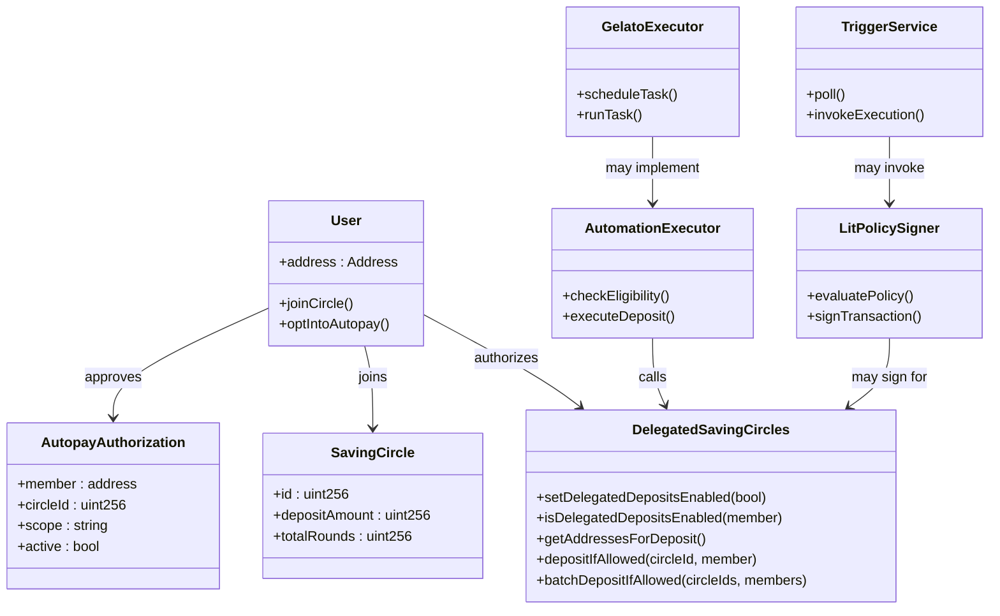
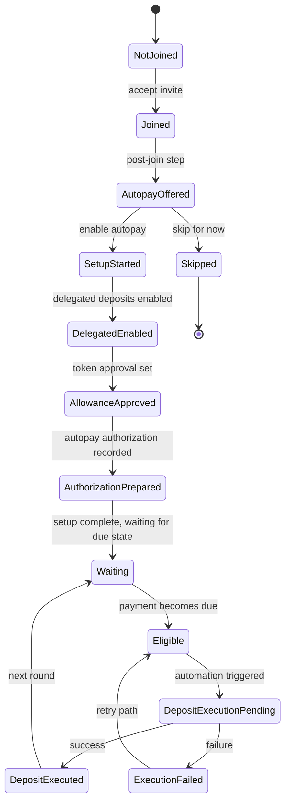
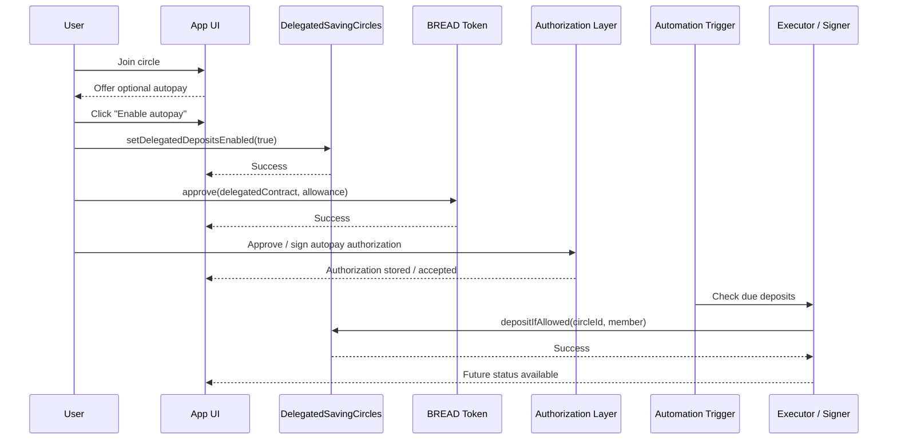
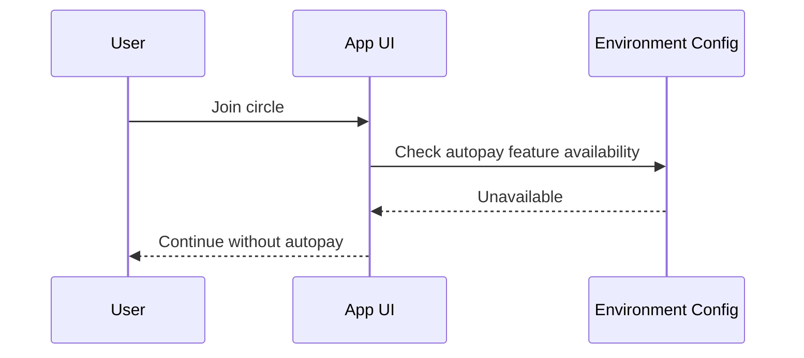
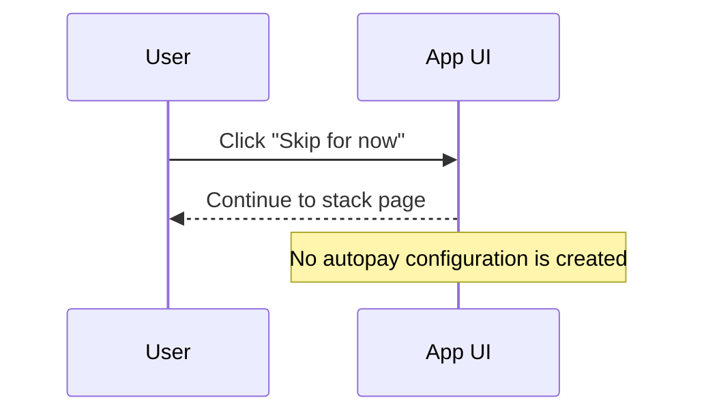
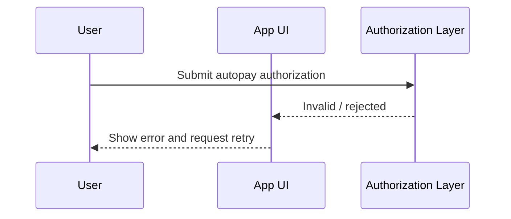
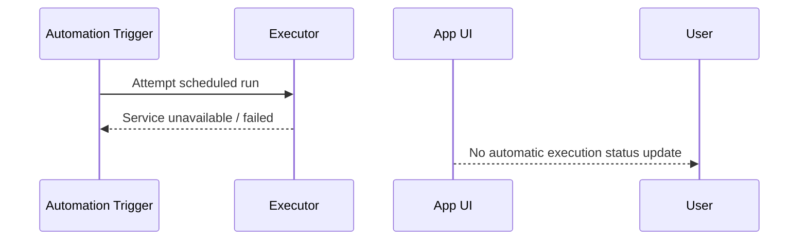
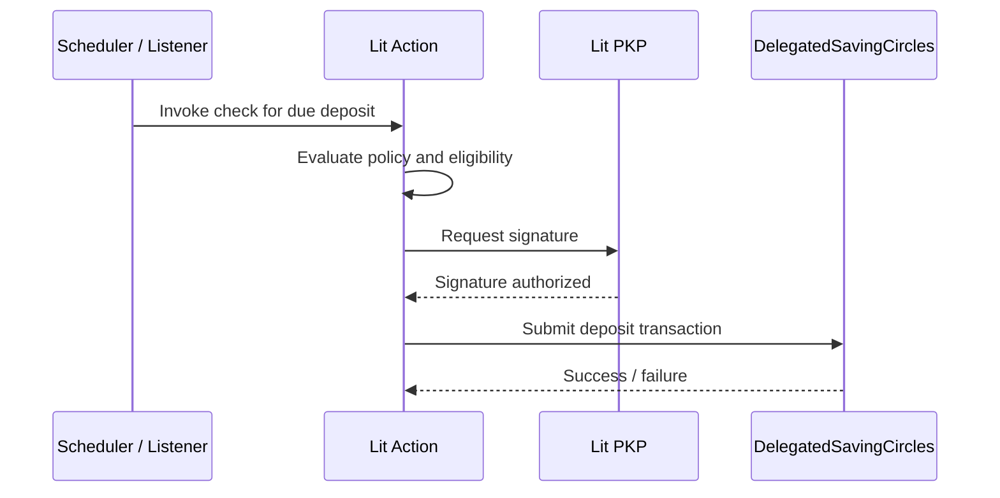
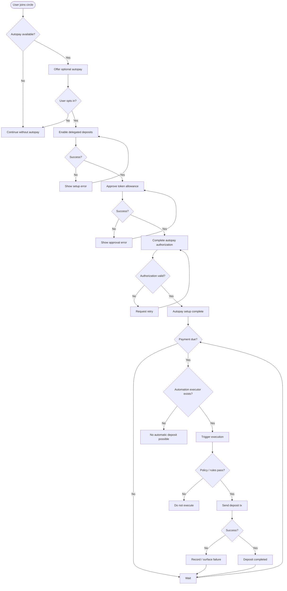
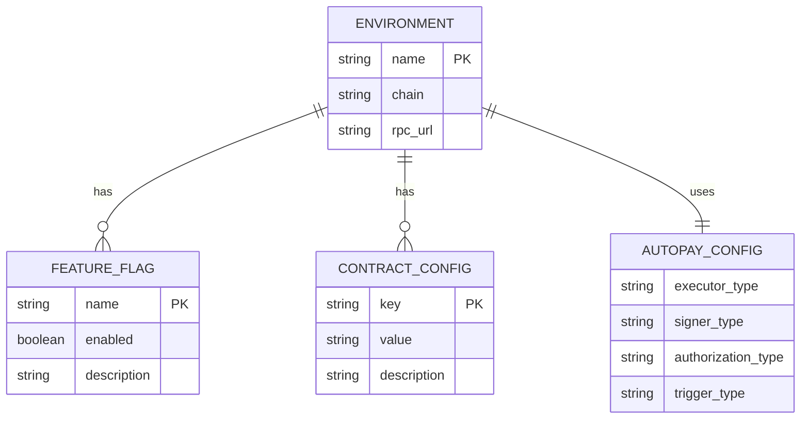

# Technical Specification

# Saving Circles Autopay Automation Proposal

**Version:** 1.0  
**Date:** 2026-03-19  
**Author:** Francisco Rolotti _(assumed; update if needed)_

---

## 1. Background

### 1.1 Problem Statement

Saving Circles currently depends on members making deposits manually when their payment is due. This creates friction for recurring participation and increases the chance of missed or delayed contributions, even when a member would be willing to authorize an automatic contribution path in advance.

The team wants to explore an optional autopay flow that a member can enable after joining a circle. The intended outcome is that once the member has opted in and granted the required permissions, future due deposits could be executed automatically without the member needing to return and manually submit each contribution.

At the moment, there is **no implemented automation layer** for this feature. Gelato had been considered as a possible automation mechanism, and Lit Protocol is being explored as a possible alternative or complement, especially around authorization and policy-controlled signing.

This specification addresses the design question of how to support delegated automated deposits for Saving Circles, and what role Gelato, Lit Protocol, a custom worker, or other automation layers might play.

---

### 1.2 Context / History

Relevant context for this effort:

- The product direction being explored is an optional autopay flow for Saving Circles
- The desired UX is that users can enable autopay shortly after joining a circle
- Gelato had been discussed as a possible automation / execution layer
- Lit Protocol is being discussed as a possible alternative or complement
- There is currently **no implemented automatic deposit execution path**
- There is currently **no Gelato integration implemented**
- There is currently **no Lit PKP / Lit Action execution implementation**
- It is still unclear whether the final architecture should prioritize:
  - simplicity
  - lowest operational burden
  - trust minimization
  - decentralized execution
  - minimal contract changes

Important architectural conclusion from prior discussion:

- Lit does **not** automatically make deposits happen by itself
- Some executor or trigger still needs to exist
- If Gelato is removed, some other automation layer is still needed
- Lit is strongest as a policy-controlled signing layer, not necessarily as a complete automation scheduler

Prior working context / draft material:

- earlier notes about a “Lit-authorized delegated deposit automation MVP”
- discussion around replacing Gelato
- discussion around whether automatic deposits can happen without human interference

---

### 1.3 Stakeholders

| Stakeholder                         | Role / Interest                                 |
| ----------------------------------- | ----------------------------------------------- |
| Bread / Saving Circles product team | Owner / consumer of the autopay feature         |
| Frontend team (`app-stacks`)        | Owner / implementer of join flow and autopay UI |
| Smart contract team                 | Dependency / validator of contract constraints  |
| Infrastructure / backend operators  | Potential owner of worker or trigger service    |
| End users / circle members          | Consumers of optional autopay                   |
| Lit Protocol                        | Potential authorization / signing integration   |
| Gelato                              | Potential automation / execution integration    |
| `DelegatedSavingCircles` contract   | Onchain integration dependency                  |
| `SavingCircles` contract            | Onchain business-logic dependency               |

---

## 2. Motivation

### 2.1 Goals & Success Criteria

Primary goals:

- Let a member opt into autopay after joining a circle
- Allow future deposits to be executed automatically once due
- Preserve explicit user consent for delegated deposits
- Explore whether Gelato should be used, replaced, or avoided
- Explore whether Lit Protocol should be used for policy-controlled authorization and signing
- Keep the experience understandable and safe enough for the intended use case

User journey goals:

- User joins a circle
- User is offered autopay as an optional next step
- User can complete setup with clear, explicit actions
- Future due deposits can happen automatically without the user manually submitting every round

Success criteria:

- Users can understand what autopay does and what permissions it requires
- Users can opt in without blocking the normal join flow
- The system can determine when a deposit is due
- The system can execute a due deposit on the user’s behalf if all required permissions are in place
- The design can operate without manual per-deposit intervention from the user
- The architecture clearly defines where trust lives

Questions / unknown measurable criteria:

- What is the acceptable delay between “payment due” and deposit execution?
- Is gelato the ideal automation service?
- Does lit protocol parcially replace Gelato?

---

## 3. Scope

### 3.1 Non-Goals

| Technical Functionality                 | Reasoning for Being Off Scope                                                                 | Tradeoffs                                |
| --------------------------------------- | --------------------------------------------------------------------------------------------- | ---------------------------------------- |
| Changes to `SavingCircles.sol`          | Current exploration assumes no core contract changes unless later approved                    | May limit automation design options      |
| Changes to `DelegatedSavingCircles.sol` | Current design discussion assumes existing delegated contract unless future work changes that | May constrain future execution patterns  |
| Analytics / dashboards                  | Not necessary for initial architecture decision                                               | Lower visibility into usage and failures |

---

### 3.2 Value Proposition

| Technical Functionality              | Value                                                             | Tradeoffs                                      |
| ------------------------------------ | ----------------------------------------------------------------- | ---------------------------------------------- |
| Post-join autopay setup              | Increases likelihood that users enable autopay at the best moment | Adds one more step after join                  |
| Delegated deposit permissions        | Makes future automated deposits possible                          | Requires explicit user trust and permissions   |
| Optional autopay flow                | Preserves user choice and does not block normal participation     | Some users may ignore setup                    |
| Automation layer for due deposits    | Reduces missed contributions and manual effort                    | Requires external execution mechanism          |
| Lit-based authorization/signing path | Could reduce reliance on a backend private key                    | Adds complexity and still needs a trigger      |
| Gelato-based execution path          | Could simplify automation operations                              | Adds external dependency and trust assumptions |

---

## 4. UML Diagrams

### 4.1 Class Diagram

**Mermaid — Class Diagram**



````

---

### 4.2 State Diagram

**Mermaid — State Diagram**



---

## 5. Step-by-Step Flows

### 5.1 Main (“Happy”) Path

**Pre-condition:**
User has successfully joined a Saving Circle, delegated deposit functionality exists onchain, and the system has a chosen automation architecture in place.

**Actor:**
User triggers autopay setup from the post-join experience or stack detail page.

**System validates:**
Membership status, delegated deposit permissions, token approval, and autopay authorization requirements.

**System persists / computes / emits:**
Autopay configuration is recorded in the chosen system, and a future automation layer may later detect eligibility and execute a deposit.

**Post-condition:**
User has opted into autopay and, once payment becomes due, the automation system can attempt deposit execution without requiring the user to return manually.

**Sequence Diagram — Happy Path**



Note:

- The exact implementation of `Authorization Layer`, `Automation Trigger`, and `Executor / Signer` is **not yet decided or implemented**
- This diagram reflects the intended target flow, not current delivered functionality

---

### 5.2 Alternate / Error Paths

| #   | Condition                                 | System Action                         | Suggested Handling                      |
| --- | ----------------------------------------- | ------------------------------------- | --------------------------------------- |
| A1  | Autopay is not configured for environment | UI does not offer full setup          | Allow user to continue normally         |
| A2  | User skips autopay                        | No autopay state is created           | Allow later setup from stack page       |
| A3  | Delegated deposits are not enabled        | Setup remains incomplete              | Prompt step completion                  |
| A4  | Token allowance is insufficient           | Deposit cannot be executed            | Prompt approval update                  |
| A5  | Authorization fails or is invalid         | Setup or execution is rejected        | Require re-authorization                |
| A6  | Payment is not yet due                    | No execution occurs                   | Show waiting state                      |
| A7  | Automation service is unavailable         | Deposit is not executed automatically | Retry later / expose status             |
| A8  | Signer policy rejects execution           | Deposit is not sent                   | Surface reason if possible              |
| A9  | Transaction reverts onchain               | Execution recorded as failed          | Retry or surface error                  |
| A10 | Gelato is not used                        | Another executor is required          | Use worker, scheduler, or other network |
| A11 | Lit is used                               | A trigger still must invoke Lit logic | Add scheduler / listener design         |
| A12 | No automation executor exists             | Autopay cannot truly happen           | Manual deposits remain necessary        |

#### Sequence Diagram — A1: Autopay Not Configured



#### Sequence Diagram — A2: User Skips Autopay



#### Sequence Diagram — A5: Authorization Failure



#### Sequence Diagram — A7: Automation Unavailable



#### Sequence Diagram — A11: Lit-Based Path Needs Trigger



---

### 5.3 Consolidated User Flow — Flowchart

**Mermaid — Consolidated User Flow Flowchart**



---

### 5.4 User Flow Requirements Checklist

| Requirement                                              | Covered By Flow(s)       | Notes                           |
| -------------------------------------------------------- | ------------------------ | ------------------------------- |
| User can join a circle and optionally enable autopay     | 5.1 Happy Path           | Main intended UX                |
| User can skip autopay without blocking participation     | 5.2 — A2                 | Important optionality           |
| Delegated deposits must be explicitly enabled            | 5.1 Happy Path           | Required permission step        |
| Token approval must be granted before automated deposits | 5.1 Happy Path           | Required execution precondition |
| User consent / authorization must be explicit            | 5.1 Happy Path, 5.2 — A5 | Form not finalized              |
| Due deposits should only execute when eligible           | 5.1 Happy Path, 5.2 — A6 | Execution gated by due status   |
| Automatic execution requires some executor               | 5.2 — A10, A11, A12      | Core architecture constraint    |
| Removing Gelato does not remove need for automation      | 5.2 — A10, A12           | Key design insight              |
| Lit can be used for policy-controlled signing            | 5.2 — A11                | Still needs trigger             |
| Normal circle usage must still work with no autopay      | 5.2 — A1, A2             | Important fallback              |

---

## 6. Configurable Variables ERD

**Mermaid — Configurable Variables ERD**



### Candidate Configurable Variables

| Variable                                  | Purpose                                    | Notes                             |
| ----------------------------------------- | ------------------------------------------ | --------------------------------- |
| Delegated Saving Circles contract address | Needed for delegated deposit interactions  | Exact env var names not finalized |
| Saving Circles contract address           | Needed for context / validation            | Confirm source of truth           |
| Lit network identifier                    | Needed only if Lit is used                 | Not final                         |
| Lit policy identifier                     | Needed only if Lit policy model is adopted | Not final                         |
| Gelato task / config identifiers          | Needed only if Gelato is adopted           | Not final                         |
| Automation enablement flag                | Turn autopay on or off per environment     | Recommended                       |
| Trigger frequency                         | Defines how often due deposits are checked | Needed if polling model is used   |
| Allowed execution networks                | Defines supported environments             | Needs decision                    |

Questions:

- What exact environment variables already exist in `app-stacks`?
- Should the feature be separately configurable per chain?
- Will autopay be enabled on local, testnet, and production in the same way?
- Is the trigger frequency fixed or configurable?

---

## 7. Edge Cases and Concessions

| Edge Case / Concession                         | Description                                           | Accepted Risk / Mitigation                             |
| ---------------------------------------------- | ----------------------------------------------------- | ------------------------------------------------------ |
| No automation exists yet                       | Current design has no implemented execution service   | Document clearly and do not overstate implementation   |
| Gelato is only a candidate                     | It has been discussed, not integrated                 | Keep vendor-specific logic out of early UX if possible |
| Lit is only a candidate                        | No PKP / Lit Action integration exists yet            | Treat Lit as future architecture option                |
| Contracts do not self-execute                  | Some external actor must always submit tx             | Must choose executor architecture                      |
| User approval scope may be broad               | Allowance / delegation can be larger than one deposit | Needs careful UX and policy design                     |
| Future execution status may be hard to show    | No finalized backend state model exists yet           | Define persistence and observability later             |
| Onchain due state vs app due state may diverge | Need a single authority for eligibility               | Clarify in implementation design                       |
| No finalized revocation model                  | User may need to disable autopay later                | Add explicit revocation flow                           |
| No finalized retry strategy                    | Failed deposits may remain unresolved                 | Add retry and alerting design                          |
| No final trust model decision                  | Backend signer vs Lit vs external network not chosen  | Must be resolved before production build               |

---

## 8. Open Questions

| #   | Question                                                                                                |
| --- | ------------------------------------------------------------------------------------------------------- |
| Q1  | Is the goal to fully replace Gelato, or just avoid depending on it by default?                          |
| Q2  | Is a self-hosted worker acceptable, or does the team want a lower-trust design?                         |
| Q3  | If Lit is adopted, will it be used for authorization only, or also for signing and broadcasting?        |
| Q4  | If Lit is adopted, what will trigger the Lit Action: cron, listener, custom service, or something else? |
| Q5  | Is any contract change acceptable in a later iteration if it improves automation design substantially?  |
| Q6  | What exact user consent payload should define autopay authorization?                                    |
| Q7  | How should users revoke or modify autopay after setup?                                                  |
| Q8  | What is the authoritative source of “payment due” for execution decisions?                              |
| Q9  | Should there be support for batching multiple eligible deposits in one run?                             |
| Q10 | What persistence layer should store autopay configuration and execution history?                        |
| Q11 | What level of auditability is required for failed and successful deposits?                              |
| Q12 | Does the team prefer external automation reliability or self-hosted control?                            |
| Q13 | What is the acceptable delay between due time and execution time?                                       |
| Q14 | Is internal testing the only immediate goal, or should this design already target production readiness? |

---

## 9. Glossary / References

### 9.1 Glossary

| Term                   | Definition                                                          |
| ---------------------- | ------------------------------------------------------------------- |
| Saving Circles         | Cooperative savings product where members contribute across rounds  |
| DelegatedSavingCircles | Contract that enables delegated deposits on behalf of members       |
| Autopay                | Optional recurring deposit flow after user setup                    |
| Gelato                 | External automation / execution service under consideration         |
| Lit Protocol           | Programmable key management and policy-controlled signing network   |
| PKP                    | Programmable Key Pair in Lit; a signer controlled by Lit policies   |
| Lit Action             | Executable logic in Lit that can evaluate rules and request signing |
| Trigger / Scheduler    | External mechanism that decides when to check and attempt execution |
| Executor               | Component that actually sends or signs the deposit transaction      |
| Due Deposit            | A deposit that is currently eligible / required for the member      |

---

### 9.2 References

- Prior draft / discussion material on autopay MVP
- `app-stacks` repository
- `saving-circles` repository
- Internal discussions about Gelato as automation candidate
- Internal discussions about Lit as authorization / signing candidate

Questions:

- Should this section include PRs, issues, or architectural notes once created?
- Should external Lit and Gelato documentation be added in the repo version?

---

## 10. Alternative Approaches

| Approach                                          | Pros                                                      | Cons                                                                 |
| ------------------------------------------------- | --------------------------------------------------------- | -------------------------------------------------------------------- |
| Gelato-based automation                           | Mature automation layer, less internal operational burden | External dependency, additional trust / vendor reliance              |
| Self-hosted worker                                | Full control, no external dependency                      | Internal ops burden, centralized signer unless improved              |
| Lit for authorization only + self-hosted executor | Better authorization model while keeping simple execution | Still centralized execution path                                     |
| Lit PKP + Lit Action + trigger service            | Reduced signer trust, policy-based execution              | More complex, still needs trigger layer                              |
| Chainlink / other automation network              | More decentralized automation option                      | Likely more integration complexity and possible contract constraints |
| Hybrid model: lightweight scheduler + Lit signer  | Balanced architecture with reduced signer trust           | Still not fully decentralized, two moving parts                      |
| Keep manual deposits only                         | Simplest system, lowest complexity                        | No autopay value, continued user friction                            |

### Decision Rationale

No final approach has been selected yet.

Current likely decision path:

1. Decide whether the primary goal is:
   - simplicity
   - self-hosting
   - trust minimization
   - avoiding external dependencies

2. Choose the architecture accordingly:
   - **Gelato** if operational simplicity is preferred
   - **self-hosted worker** if control is preferred
   - **Lit + trigger layer** if trust in signing should be reduced
   - **hybrid** if the team wants a middle ground

At the moment, the document reflects a proposed direction rather than a finalized implementation choice.

---

## 11. Relevant Metrics

| Metric                           | Description                                     | Target                                      |
| -------------------------------- | ----------------------------------------------- | ------------------------------------------- |
| Autopay setup completion rate    | % of eligible users who complete autopay setup  | Question: target unknown                    |
| Time to complete setup           | Time from autopay offer to completed setup      | Question: target unknown                    |
| Autopay adoption rate            | % of joined users who opt into autopay          | Question: target unknown                    |
| Automatic execution success rate | % of due deposits executed successfully         | Question: target unknown                    |
| Execution latency                | Time from due state to tx submission            | Question: target unknown                    |
| Authorization failure rate       | % of setup attempts rejected due to auth issues | Low                                         |
| Execution failure rate           | % of attempted automatic deposits that fail     | Question: target unknown                    |
| Revocation success rate          | % of users able to disable autopay correctly    | 100% once implemented                       |
| User support incidents           | Number of autopay-related support issues        | Should decrease relative to manual friction |
| Manual missed-deposit rate       | % of due deposits missed by opted-in users      | Should be materially reduced                |

---
````
